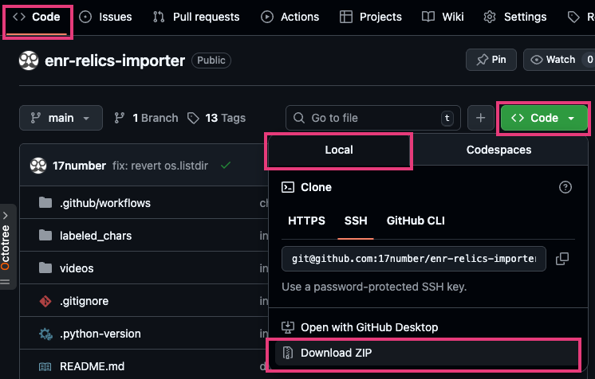

# enr-relics-importer

ELDEN RING NIGHTREIGN の遺物を CSV 形式で出力するツール。

遺物儀式画面のキャプチャ動画(右入力して対象遺物をすべて撮影)を解析し、パターンマッチングで 遺物名/効果/デメリット を特定して CSV 出力。

出力された CSV は [遺物組み合わせ(ビルド)探索ツール](https://17number.github.io/enr-relics-simulator/) へのインポートにも利用可能。

## 注意事項

- パターンマッチング ＆ 効果テキストとの一致度 での判定につき、100% の精度を保証するものではない
  - 出力結果が正しくない場合は CSV を直接修正して良い
- 処理都合上、以下には非対応
  - 通常とは異なる比率で撮影された動画
    - ウルトラワイドモニター設定など
    - ゲーム画面以外(Windows のタイトルバー部分など)を含む
  - 日本語以外の言語で撮影された動画
- 以下環境の動作検証は未実施
  - Windows 環境での解析
  - steam 版の撮影動画からの解析
  - Xbox 版の撮影動画からの解析
  - 縦横サイズが検証動画と異なる動画からの解析
  - ゲーム中の HDR 設定、輝度設定、画質設定を変更した動画からの解析。検証は以下設定でのみ実施。
    - HDR: ON
    - 輝度設定: HDR ON につき設定不可
    - 画質設定
      - 輝度調整: 10
      - 最大輝度: 2000
      - 彩度調整: 5

## 使い方

### 事前準備: ツールの インストール/ダウンロード

- [Docker Desktop](https://www.docker.com/ja-jp/products/docker-desktop/) をインストールして起動
- [GitHub](https://github.com/17number/enr-relics-importer) の Download ZIP から ZIP ファイルをダウンロード(下記画像を参照)
  - ダウンロード後、ZIP ファイルは展開(解凍)しておく



### ゲーム画面の動画撮影

※撮影イメージサンプル: [relics_sample.mp4](https://github.com/17number/enr-relics-importer/raw/refs/heads/main/relics_sample.mp4)

- 遺物儀式画面を表示
- フィルター設定を更新
  - フィルター: 無し
  - ソート: 入手順
- 以下のどちらかで所持遺物一覧(画面右側)にフォーカス
  - キャラクターの遺物設定画面で、Lスティックを右に倒す
  - 一番左にある売却タブに移動
- 解析対象遺物の1つ目に合わせて動画撮影を開始
  - PS5 は撮影開始後、数秒待った方が良い(開始直後のデータは消えたりするため)
  - PC/Xbox 環境は待つ必要無いかもしれない、不明
- 最後の解析対象遺物にたどり着く十字キー右を入力し続ける
  - PS5 はたどり着いた後、数秒待った方が良い(撮影終了直前のデータは消えたりするため)
  - PC/Xbox 環境は待つ必要無いかもしれない、不明
- すべての遺物が表示されたら録画終了
- 撮影動画を PC に移す
  - PS5 は [PlayStation App](https://www.playstation.com/ja-jp/playstation-app/) 経由
  - Xbox も[公式機能](https://support.xbox.com/ja-JP/help/games-apps/my-games-apps/manage-clips-with-upload-studio)でいけるはず

### 遺物一覧CSV作成

- 撮影動画のファイル名を `relics.mp4` に変更
  - ファイル名は固定
  - mp4 形式ではない場合、mp4 形式に変換しておく
- `relics.mp4` を解析用ツールフォルダ(ディレクトリ)に配置
- 解析用プログラムを実行
  - win: `run_analyze_relics.bat`
  - mac: `run_analyze_relics.command`
  - PC スペック、動画サイズ、PC 使用状況 などで解析時間は変動
- 完了後、 `output` 内に `relics_YYYYMMDD_HHmmss.csv` として出力
  - 例: `relics_20251027_120702.csv`

## 補足など

- CSV 作成後に所持遺物が増えた場合は、増えた部分のみの動画を撮影して新たに CSV 作成し、2つの CSV のデータを手動で結合すれば良い
  - 1列目(列A: `No.`)は人間用(識別用)のデータなので完全な連番じゃなくても問題ない
- CSV 作成後に所持遺物を売却した場合は、売却した部分を CSV から直接削除して良い
  - 新たに全遺物の動画を撮影して CSV を作成しなおすでも良い

## 開発者向け

- 生成 AI 主体でコード作成したためよろしくない実装になっている可能性あり
  - 見づらい/非効率/etc

### テンプレート画像抽出

`extract_templates.py` で動画から遺物名、遺物効果の文字、デメリット効果の文字を `labeled_chars/` に保存。

抽出対象の動画は `videos/` 配下に `.mp4` ファイルを配置しておく。

```bash
uv run extract_templates.py
```

### 遺物解析

`analyze_relics.py` で動画から CSV を作成する。

解析対象の動画を `relics.mp4` としてリポジトリルートに配置しておく。

```bash
uv run analyze_relics.py
```

### ビルド方法

```bash
uv run pyinstaller --onefile --add-data "labeled_chars:labeled_chars" analyze_relics.py
```
